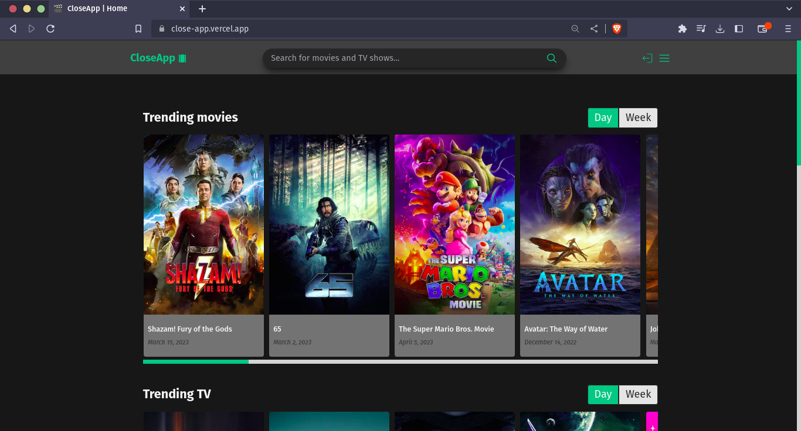
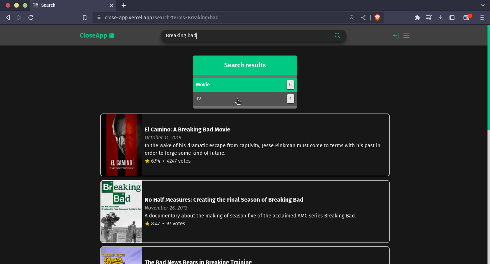
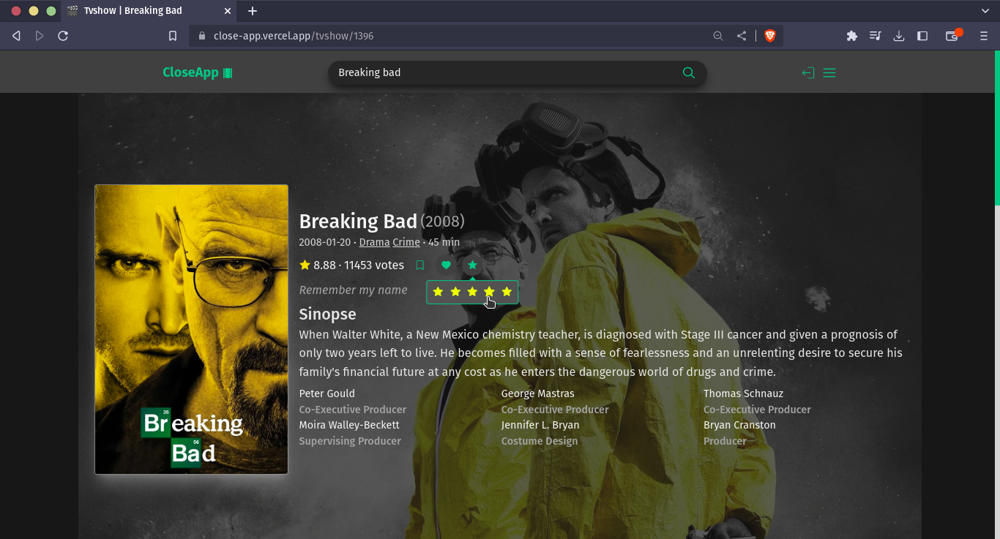
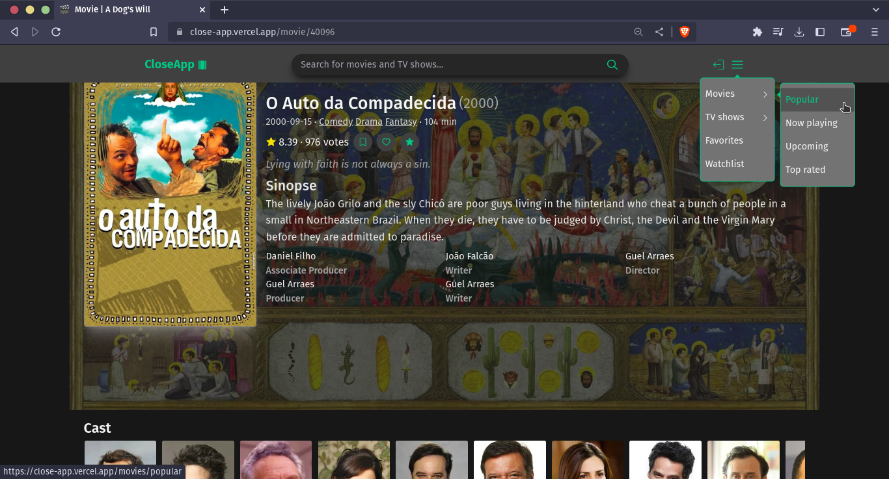
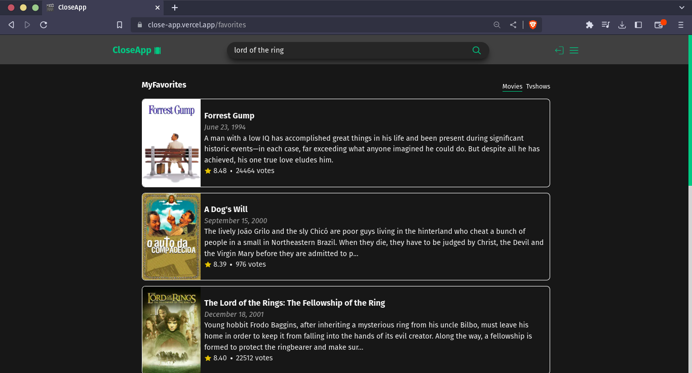

<h1 align="center">CloseApp 🎥</h1>

    This is an application that allows you to access information about movies and TV shows, such as cast, budget, description, and more. Additionally, you can log in to add movies and TV shows to your own watchlist, as well as rate and like them.

 <a href="#pre-requisitos">Prerequisites</a> •
 <a href="#objetivo">Goals</a> •
 <a href="#tecnologias">technologies</a> • 
 <a href="#autor">Author</a>

<h4 align="center"> 
    CloseApp 🚀 completed!
</h4>

<h3 id="pre-requisitos">Prerequisites</h3>

If you want to fork the project and play around, read bellow: 

Before starting, you will need to have the following tools installed on your machine:
[Git](https://git-scm.com) and [Node](https://nodejs.org/en/).
Besides, it's good to have an editor to work with the code like [VSCode](https://code.visualstudio.com/),
or [Neovim](https://neovim.io/)

if you want to run the app in your machine, follow the steps above:

- Clone the repository:

<code>git clone https://github.com/TiagoAraujoDev/closeApp.git</code>

- Change to the repository folder, install the dependencies and run the script to run the application locally:

<code>cd closeApp</code>

<code>npm install</code>

<code>npm run dev</code>

<h3 id="objetivo">🎯 Goals</h3>

- I love to watch movies and series, so what's better than building your own site to check movie information, add to watchlist, and favorite them? That's why I decided to build an application that works similarly to IMDB.- The main proporse here was to use a third part API(TMDB), so I dive hard into their documentation.
- When I built this project, the React team had just finished their new documentation. In the documentation, they advised starting the project with a framework, and I decided to go with [Next.js](https://beta.nextjs.org/docs).
- In this project I used some libs. 
    - React query
    - Axios
    - Radix-ui
    - tailwindcss
- The project was deployed in [Vercel](https://vercel.com).

<h3 id="tecnologias">🛠 technologies</h3>

The following tools were used to build the project:

- [Typescript](https://www.typescriptlang.org/)
- [ReactJS](https://www.reactjs.org/)
- [Next.js](https://beta.nextjs.org/docs)

<h3 id="autor">Author</h3>

<a href="https://www.linkedin.com/in/tiago-muniz-de-araujo-2b5b8a89/">
 
  
 <b>Tiago Araujo</b></a>🚀

Made by Tiago Araujo 👋🏽 contact!

